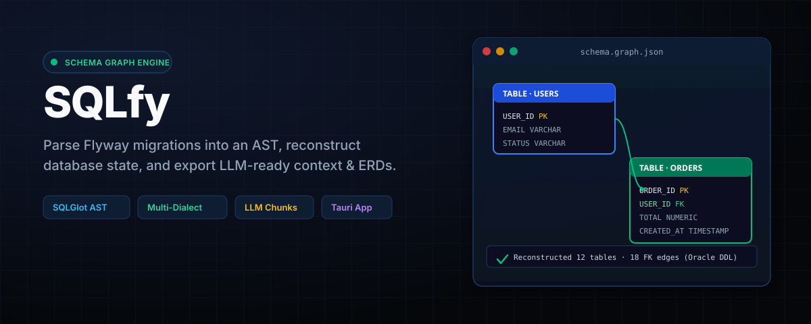
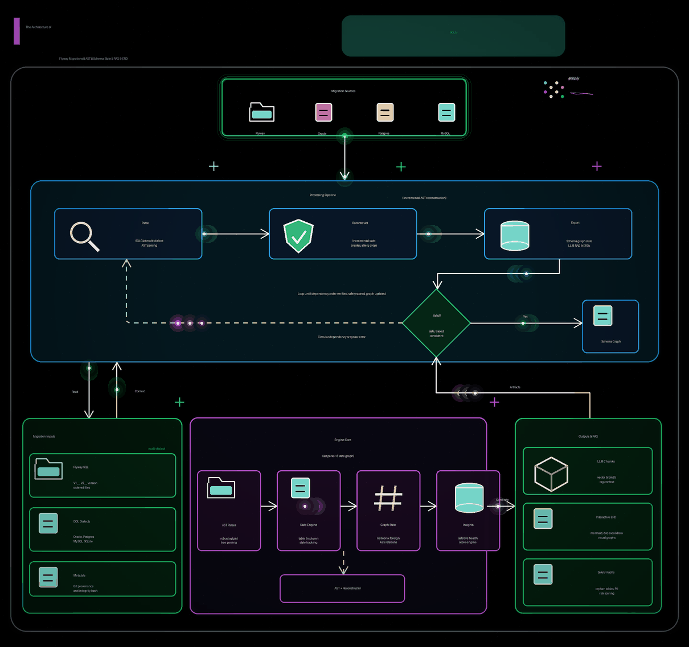

<div align="center">



# SQLfy

**Schema Graph Engine** — Parse Flyway migrations into an AST, reconstruct your database schema state, and export LLM-ready vector context & interactive ERDs.

[](https://pypi.org/project/sqlfy-cli/)
[](https://pypi.org/project/sqlfy-cli/)
[](https://github.com/paulushcgcj/sqlfy/actions/workflows/ci.yml)
[](LICENSE)
[](app/)
[](cli/tests/)

</div>

---

## ⚡ What is SQLfy?

SQLfy reads a set of Flyway migration files in version order (`V1__`, `V2__`, …), parses each DDL statement into an abstract syntax tree via **SQLGlot**, and reconstructs the **final state** of your database schema. From that state, it provides:

- 📊 **Interactive ERD & Visual Graph** (Mermaid, DOT, Excalidraw, Draw.io, HTML)
- 🔍 **Structured Schema Explorer** (Tables, columns, precision, constraints, indexes, comments)
- 🤖 **LLM RAG Chunks** (Pre-formatted context blocks ready for AI-assisted SQL generation)
- 🛡️ **Migration Health & Insights** (Orphan tables, missing primary keys, safety scoring, drift detection)

---

## 🚀 Quick Start

### Desktop App (React + Vite + Tauri)

```bash
cd app
npm install
npm run dev          # Vite dev server (browser)
npx tauri dev        # Tauri desktop window
```

The app comes pre-loaded with sample Oracle DDL. Drop your own Flyway migration files or add them via **+ Add Migration File**, then click **▶ Parse →**.

### Python CLI

```bash
cd cli
pip install .        # install package
sqlfy-cli ./samples  # run human-readable schema summary
```

---

## 📥 Installation

**Mac / Linux**
```bash
curl -fsSL https://raw.githubusercontent.com/paulushcgcj/sqlfy/main/install.sh | bash
```

**Windows (PowerShell)**
```powershell
irm https://raw.githubusercontent.com/paulushcgcj/sqlfy/main/install.ps1 | iex
```

**Via pip / uv (all platforms)**

```bash
pip install sqlfy-cli
# or
uv tool install sqlfy-cli
```

> **macOS Note:** If you encounter a security warning, run once:
> `xattr -d com.apple.quarantine /usr/local/bin/sqlfy-cli`

---

## 🔄 How It Works

<div align="center">

</div>

```
Flyway SQL files  →  sqlglot AST  →  Reconstructor  →  Schema Graph State  →  LLM Chunks / ERDs
```

1. **Parsing:** DDL statements are parsed using [sqlglot](https://github.com/tobymao/sqlglot) for robust multi-dialect AST fidelity.
2. **Reconstruction:** Incremental state engine applies creates, alters drops, and renames in exact version order.
3. **Analysis & Export:** Builds a serializable `SchemaState` snapshot powering the UI, CLI tools, insights engine, and RAG context generator.

---

## 🌐 Multi-Dialect Support

SQLfy supports multiple SQL dialects with automatic type normalization:

| Dialect | Invoke Command | Type Normalization Examples |
|:---|:---|:---|
| **Oracle** *(default)* | `--dialect oracle` | `VARCHAR2` → `VARCHAR`, `NUMBER` → `NUMERIC` |
| **PostgreSQL** | `--dialect postgres` | `SERIAL` → `INTEGER`, `TEXT` → `VARCHAR` |
| **MySQL** | `--dialect mysql` | `TINYINT` → `SMALLINT`, `DATETIME` → `TIMESTAMP` |
| **SQLite** | `--dialect sqlite` | `TEXT` → `VARCHAR`, `REAL` → `FLOAT` |

**Example:**
```bash
sqlfy dump ./postgres-migrations --dialect postgres
sqlfy graph ./mysql-migrations --dialect mysql --format mermaid
sqlfy insights ./sqlite-migrations --dialect sqlite
```

---

## 🛠️ CLI Reference

SQLfy exposes **34 top-level subcommands** (plus `hooks` actions). Start with
schema reconstruction, inspection, visualization, and change analysis; the
workflow and experimental commands are available when you need them.

| Subcommand | Description |
|:---|:---|
| `dump` | Output the Schema State Dictionary (JSON / YAML) |
| `manifest` | Output graph manifest/metadata with high-level summary |
| `chunks` | Output LLM vector context chunks |
| `diff` | Compare two Schema State Dictionaries or migration directories |
| `diff-versions` | Compare two version snapshots from the same migration set |
| `graph` | Graph representation (DOT, Mermaid, Excalidraw, Draw.io, JSON, HTML) |
| `graph-migrations` | Visualize migration timeline and dependency graph |
| `build-graph` | Build complete `graphify-out/` directory (unified all-in-one) |
| `rollback-analysis` | Analyze rollback feasibility and generate rollback scripts |
| `lint` | Lint migration SQL for quality and style using sqlfluff |
| `insights` | Analyse schema and report findings (orphan tables, missing PKs) |
| `health` | Generate migration folder health report with quality score |
| `simulate` | Simulate schema evolution with hypothetical migrations |
| `integrity` | Check migration file integrity using SHA256 hashes |
| `provenance` | Collect git provenance for migration files |
| `cache` | Manage file-based caching system |
| `ask` | Ask a natural language question about the schema (RAG) |
| `chat` | Interactive multi-turn schema chat session |
| `export` | Export schema as self-contained HTML documentation |
| `query` | Deterministic graph queries (tables, columns, FK paths, cycles) |
| `impact` | Analyze impact of schema object changes using graph traversal |
| `lineage` | Column-level lineage and data flow analysis |
| `domains` | Detect semantic business domains using community detection |
| `stability` | Calculate schema stability metrics and churn rates |
| `validate` | Validate migration ordering and detect issues |
| `deps` | Analyze migration dependencies and detect circular dependencies |
| `drift` | Detect schema drift between folders and generate repair SQL |
| `classify` | Classify migrations by semantic category |
| `naming` | Enforce migration filename naming conventions |
| `cost` | Estimate migration execution cost and category |
| `safety` | Score migrations by safety level (SAFE / HIGH_RISK / DANGEROUS) |
| `pii-scan` | Scan schema columns for PII patterns (GDPR/CCPA compliance) |
| `watch` | Auto-rebuild analysis when migration files change |

> Use `sqlfy <subcommand> --help` for detailed usage and flags.

---

## 🤖 LLM Usage & RAG Chunks

> [!IMPORTANT]
> **Vector embeddings require an API key.**
> The `ask` and `chat` subcommands support a `--embed` flag switching from local BM25 to dense vector search via [Voyage AI](https://voyageai.com) (`voyage-3`, via Anthropic API). Set `ANTHROPIC_API_KEY` in your environment. Without `--embed`, retrieval uses zero-config local BM25.

### Sample Table Chunk Output
```
TABLE: APP.ORDERS
Schema: APP | Created: V2

COLUMNS:
  ORDER_ID: NUMBER(10) [PK, NOT NULL]
  USER_ID: NUMBER(10) [NOT NULL, FK]
  TOTAL_AMOUNT: NUMBER(12,2) [NOT NULL]
  STATUS: VARCHAR2(20) [NOT NULL, DEFAULT PENDING]
  CREATED_AT: TIMESTAMP [NOT NULL, DEFAULT SYSTIMESTAMP]

REFERENCES (outgoing FK):
  USER_ID → APP.USERS(USER_ID) ON DELETE CASCADE [FK_ORDERS_USER]

INDEXES:
  IDX_ORDERS_USER: (USER_ID) [V2]
```

---

## 📁 Repository Structure

```
sqlfy/
├── app/          # React 19 + Vite + Tauri desktop UI
├── cli/          # Python CLI & Schema Graph Engine
│   ├── src/sqlfy/
│   │   ├── core.py          # Schema graph engine & chunk builder
│   │   ├── reconstructor.py # Stateful incremental migration processor
│   │   ├── schema_state.py  # Serializable schema snapshot dictionary
│   │   └── main.py          # argparse CLI entry point
│   ├── tests/               # pytest suite (140+ tests)
│   └── pyproject.toml
└── samples/      # Shared Flyway .sql test fixtures (Oracle DDL)
```

---

## 🏗️ Development

### Desktop App
```bash
cd app
npm install
npm run dev          # Vite dev server (browser mode)
npm run build        # Production Vite build
npm run lint         # ESLint check
npx tauri dev        # Tauri desktop window (Rust + Cargo)
```

### Python CLI
```bash
cd cli
pip install -e ".[dev]"   # editable install + test dependencies
python -m pytest -v       # run test suite (140+ tests)
python -m sqlfy ./samples # run directly without installation
```

---

## 📜 License

Distributed under the **GNU GPL v3.0 License**. See [LICENSE](LICENSE) for details.
